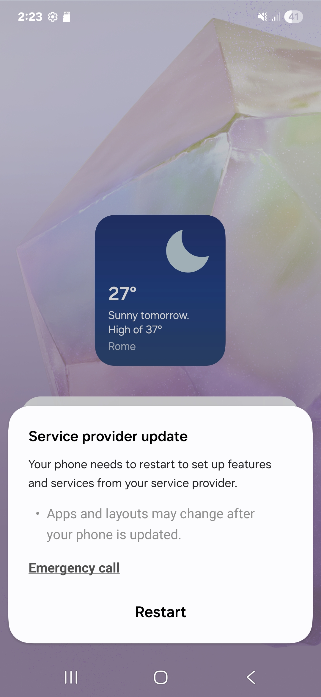

# Magisk-CIDManager-Remover
This Magisk module completely removes the system app 'com.samsung.android.cidmanager' from Samsung devices

## Why remove it

CIDManager is responsible for carrier and CSC checks. On rooted devices, it often causes unwanted behavior such as persistent pop-ups or configuration prompts, especially on the home screen. This module disables it completely.

## What the module does

It replaces the folder `/system/priv-app/CIDManager` with an empty overlay, preventing Android from loading the app. The system partition is not modified and the change is fully reversible.

## Installation

1. Download the ZIP or create one by zipping the folder above
2. Open Magisk > Modules > Install from storage
3. Select the ZIP file
4. Reboot your device

## Screenshot

The module removes the popup shown below:

## Disclaimer

This module is provided as is. The author is not responsible for any issues caused by its use. Use at your own risk.
